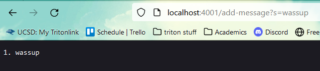
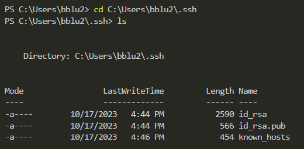
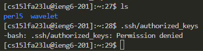
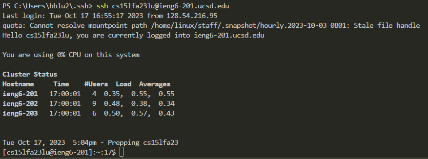

# Lab Report 2
---
## Part 1: 
String Server Code:
```
import java.io.IOException;
import java.net.URI;

class Handler implements URLHandler {
    String string = "";
    int index = 0;
    
    public String handleRequest(URI url) {
        if (url.getPath().equals("/")) {
            return "Hello! Add a String!";
        } else {
            if (url.getPath().contains("/add-message")) {
                String[] parameters = url.getQuery().split("=");
                if (parameters[0].equals("s")) {
                    String s = parameters[1];
                    index++;
                    string += String.format("%d. %s \n", index, s);
                    return string;
                    }
            }
        }
        return "404 Not Found!";
    }
}

class StringServer {
    public static void main(String[] args) throws IOException {
        if(args.length == 0){
            System.out.println("Missing port number! Try any number between 1024 to 49151");
            return;
        }

        int port = Integer.parseInt(args[0]);

        Server.start(port, new Handler());
    }
}
```


The handleRequest method is being called and the argument it is taking in is the URL of the server. From the URL, the method is checking the path and query. If the path is `/add-message`, then the method will look at the query and take the string part of after the = and set it to `s`. There is also the `index` field that will increment everytime we "add a message", or everytime we have the add-message path. In this case, it increments from 0 to 1. At the end, it will concatenate `index` and `s` and skip a line onto the `string` field, which was originally empy, where we now have what is returned in the image.


The handleRequest method is being called and the argument it is taking in is the URL of the server. From the URL, the method is checking the path and query. If the path is `/add-message`, then the method will look at the query and take the string part of after the = and set it to `s`. There is also the `index` field that will increment everytime we "add a message", or everytime we have the add-message path. In this case, it increments from 1 to 2. At the end, it will concatenate `index` and `s` and skip a line onto the `string` field, which had only "1. wassup", where we now have what is returned in the image.

---
## Part 2





