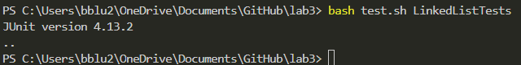

# Lab Report 2
---
## Part 1: 
LinkedList Append Bug:

Failure-Inducing Input:
```
@Test
    public void appendTest2() {
        LinkedList test = new LinkedList();
        test.append(1);
        test.append(2);
        test.append(3);
        assertEquals("1 2 3 " , test.toString());
    }
```
Non-Failure-Producing Input:
```
    @Test
    public void appendTest1() {
        LinkedList test = new LinkedList();
        test.append(1);
        test.append(2);
        assertEquals("1 2 " , test.toString());
    }
```
Symptoms:



Bug:

Before:
```
public void append(int value) {
        if(this.root == null) {
            this.root = new Node(value, null);
            return;
        }
        // If it's just one element, add if after that one
        Node n = this.root;
        if(n.next == null) {
            n.next = new Node(value, null);
            return;
        }
        // Otherwise, loop until the end and add at the end with a null
        while(n.next != null) {
            n = n.next;
            n.next = new Node(value, null);
        }
    }
```
After:
```
    public void append(int value) {
        if(this.root == null) {
            this.root = new Node(value, null);
            return;
        }
        // If it's just one element, add if after that one
        Node n = this.root;
        if(n.next == null) {
            n.next = new Node(value, null);
            return;
        }
        // Otherwise, loop until the end and add at the end with a null
        while(n.next != null) {
            n = n.next;
        }
        n.next = new Node(value, null);
    }
```
The fix was to move the `n.next - new Node(value, null);` statement outside the while loop. When it was inside the while loop, as we iterate through the list, we would keep on adding onto the list, so we would never reach the end. Moving the statement outside the loop would make it so that we would only add onto the list once we reach the end and stop iterating.

## Part 2: 

`grep -v`
```
bblu2@bluLT MINGW64 ~/OneDrive/Documents/GitHub/docsearch (main)
$ grep -v 'a' technical/911report/chapter-2.txt

            THE FOUNDATION OF THE NEW TERRORISM
            A DECLARATION OF WAR

                these themes.

            BIN LADIN'S APPEAL IN THE ISLAMIC WORLD

                nonbeliever worthy of destruction.

                support for their countries' repressive rulers.
                desire life."

            THE RISE OF BIN LADIN AND AL QAEDA (1988-1992)

                    circle.

                    well.

            BUILDING AN ORGANIZATION, DECLARING WAR ON THE UNITED STATES
                (1992-1996)

                    unknown.

                the cylinder, then discovered it to be bogus.

                    request.

                connections.

                    section.

            AL QAEDA'S RENEWAL IN AFGHANISTAN (1996-1998)

                    entirely.
```
```
bblu2@bluLT MINGW64 ~/OneDrive/Documents/GitHub/docsearch (main)
bblu2@bluLT MINGW64 ~/OneDrive/Documents/GitHub/docsearch (main)
$ grep -v 'a' technical/government/About_LSC
grep: technical/government/About_LSC: Is a directory
```
For `-v` in addition with `grep`, it output the lines that DID NOT have the given argument and this is useful if we want to look for lines without certain keywords or phrases in them.


`grep -L`
```
bblu2@bluLT MINGW64 ~/OneDrive/Documents/GitHub/docsearch (main)
$ grep -L 'z' technical/biomed/*.txt
technical/biomed/1471-230X-1-6.txt
```
```
bblu2@bluLT MINGW64 ~/OneDrive/Documents/GitHub/docsearch (main)
$ grep -L 'you' technical/government/About_LSC/*.txt
technical/government/About_LSC/Comments_on_semiannual.txt
technical/government/About_LSC/conference_highlights.txt
technical/government/About_LSC/CONFIG_STANDARDS.txt
technical/government/About_LSC/LegalServCorp_v_VelazquezDissent.txt
technical/government/About_LSC/LegalServCorp_v_VelazquezOpinion.txt
technical/government/About_LSC/LegalServCorp_v_VelazquezSyllabus.txt
technical/government/About_LSC/ODonnell_et_al_v_LSCdecision.txt
technical/government/About_LSC/reporting_system.txt
technical/government/About_LSC/Special_report_to_congress.txt
technical/government/About_LSC/State_Planning_Special_Report.txt
```

For `-L` in addition with `grep`, it output names of the files that DID NOT have the given argument in them and this is useful if we want to look for files without certain keywords or phrases in them.


`grep -c`
```
bblu2@bluLT MINGW64 ~/OneDrive/Documents/GitHub/docsearch (main)
$ grep -c 'you' technical/government/About_LSC/ONTARIO_LEGAL_AID_SERIES.txt
42
```
```
bblu2@bluLT MINGW64 ~/OneDrive/Documents/GitHub/docsearch (main)
$ grep -c 'Background' technical/biomed/*.txt
technical/biomed/1468-6708-3-1.txt:0
technical/biomed/1468-6708-3-10.txt:0
technical/biomed/1468-6708-3-3.txt:0
technical/biomed/1468-6708-3-4.txt:0
technical/biomed/1468-6708-3-7.txt:1

---LOT OF OUTPUT---

technical/biomed/gb-2003-4-8-r50.txt:1
technical/biomed/gb-2003-4-8-r51.txt:0
technical/biomed/gb-2003-4-9-r57.txt:1
technical/biomed/gb-2003-4-9-r58.txt:1
technical/biomed/gb-2003-4-9-r60.txt:0
technical/biomed/rr166.txt:0
technical/biomed/rr167.txt:0
technical/biomed/rr171.txt:0
technical/biomed/rr172.txt:0
technical/biomed/rr191.txt:0
technical/biomed/rr196.txt:0
technical/biomed/rr37.txt:0
technical/biomed/rr73.txt:0
technical/biomed/rr74.txt:0
```

For `-c` in addition with `grep`, it outputs the number of lines that had the given argument in them and this is useful if we want to look for how many lines have the certain keyword or phrase in them.


`grep -n`
```
bblu2@bluLT MINGW64 ~/OneDrive/Documents/GitHub/docsearch (main)
$ grep -n 'you' technical/government/About_LSC/ONTARIO_LEGAL_AID_SERIES.txt
7:Thank you for inviting me to your wonderful Country and the
8:beautiful city of Toronto to talk with you about the subject that
11:people who could not otherwise afford legal aid. As did many of you
22:would no longer exist. But as we all know today that young women
27:young attorneys are providing legal assistance to the children and
39:continues to live younger more idealistic lawyers-a whisper of the
45:That's what I will speak to you about today. Although most of my
128:I think that it is important for you to know that LSC initially
205:the walls of LSC you will find employees who still do not
381:client goes unserved. Ten years ago, a judge was someone you saw
382:behind the bench when you went to court. Today, judges from all
406:you propose to launch to address issues that trouble your legal
439:to conclude my remarks today by offering you some guidance as you
440:give thought to launching your own planning initiative. Consider
446:offices, such change is only possible if you are willing to be
450:your providers in the field but within your own organization(s).
462:do the same. You will need-all of you will need-to be highly
463:visible personally and professionally. And you must recognize and
464:accept that doing so will take inordinate amounts of your time and
465:your energy.
466:Third, you will-let me repeat that loudly and firmly-you WILL
469:However, the good news is that you can slowly overcome this
480:celebrate your intermediary successes along the journey.
482:Planning is not an end. It is a means to an end and you must
483:clearly and consistently articulate the "end" that you envision.
487:share "best practices." Be willing to stick your neck out and hold
496:Fifth, put your money where your mouth is. Set aside money
502:reason. Planning has "costs" and you need to be seen as an
506:Sixth-Familiarize yourself with Sol Alinksy's Rules for
507:Radicals. Not because you are going to use it. But because Mr.
508:Alinksy lays out what you can personally expect to happen to you if
509:you are in the forefront of this initiative. Mr. Alinksy instructs
511:personal. And that may be you- at the wrong end of the personal
513:by the venom. Although your journey is going to be difficult and at
514:times you will doubt yourselves, the benefits to clients are well
517:went before is deeply rewarding. And remember what your Grandmother
518:probably said to you a long time ago-what doesn't kill you probably
519:makes you stronger.
521:internally among all of your staff. One of the most stupid errors
528:And, finally-keep your eye on the prize. Remember the person who
529:first decided to go to law school, think about that young excited
542:Thank you again for allowing me to be with you today.
```
```
bblu2@bluLT MINGW64 ~/OneDrive/Documents/GitHub/docsearch (main)
$ grep -n 'you' technical/government/About_LSC
grep: technical/government/About_LSC: Is a directory
```

For `-n` in addition with `grep`, it outputs the line that has the keyword or phrase in it along with the line number, and this is useful if we want to know which lines contain the certain keyword or phrase.


For all command options, I learned them from: [Link](https://www.oreilly.com/library/view/macintosh-terminal-pocket/9781449328962/re39.html)


[HOME](https://guiuiy.github.io/cse15l-lab-reports/)


