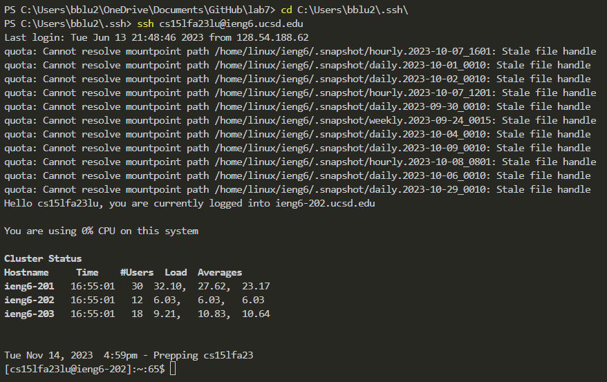
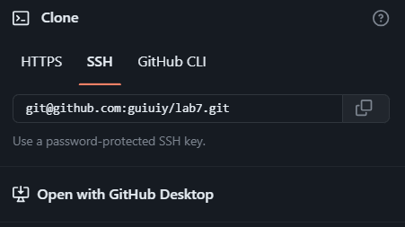
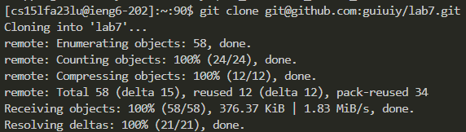
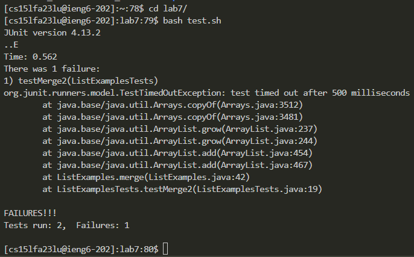

# Lab Report 4
---
## vim

Step 4. Log into ieng6

Keys Pressed: `c` `d` <Space> `u` <Tab> `b` <Tab> `.` `s` <Tab> <Enter>
              The first command was to go the the .ssh directory so that I was able to login without the password, using tab to autocomplete the paths.
              `s` `s` `h` `c` `s` `e` `1` `5` `l` `f` `a` `2` `3` `l` `u` `@` `i` `e` `n` `g` `6` `.` `u` `c` `s` `d` `.` `e` `d` `u` <Enter>
              Then I used ssh to enter the remote server.

Step 5. Clone your fork of the repository from your Github account (using the `SSH` URL)

Keys Pressed: [copy the ssh key from the GitHub page]
              `g` `i` `t` <Space> `c` `l` `o` `n` `e` <Space> <Ctrl>+`v` <Enter>
              Use the `git clone` command and copy and paste the ssh clone URL.

Step 6. Run the tests, demonstrating that they fail

Keys Pressed: `c` `d` <Space> `l` <Tab> <Enter>
              Use the `cd` command to go into the lab7 directory.
              `b` `a` `s` `h` <Space> `t` <Tab>
              Use the `bash` command to run test.sh which runs the JUnit tests.

Step 7. 
