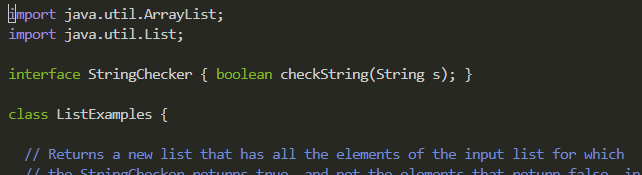

# Lab Report 4
---
## vim

## Step 4. Log into ieng6

Keys Pressed: 

`c` `d` `<Space>` `u` `<Tab>` `b` `<Tab>` `.` `s` `<Tab>` `<Enter>`: The first command was to go the the .ssh directory so that I was able to login without the password, using tab to autocomplete the paths.
              
`s` `s` `h` `c` `s` `e` `1` `5` `l` `f` `a` `2` `3` `l` `u` `@` `i` `e` `n` `g` `6` `.` `u` `c` `s` `d` `.` `e` `d` `u` `<Enter>`: Then I used ssh to enter the remote server.

## Step 5. Clone your fork of the repository from your Github account (using the `SSH` URL)

Keys Pressed: 

[copy the ssh key from the GitHub page]

`g` `i` `t` `<Space>` `c` `l` `o` `n` `e` `<Space>` `<Ctrl>`+`v` `<Enter>`: Use the `git clone` command and copy and paste the ssh clone URL.

## Step 6. Run the tests, demonstrating that they fail

Keys Pressed: 

`c` `d` `<Space>` `l` `<Tab>` <Enter>: Use the `cd` command to go into the lab7 directory, using tab to autocomplete the paths.

`b` `a` `s` `h` `<Space>` `t` `<Tab>`: Use the `bash` command to run test.sh which runs the JUnit tests, using tab to autocomplete the paths.

## Step 7. Edit the code file to fix the failing test

Keys Pressed:

`v` `i` `m` `<Space>` `L` `<Tab>` `.` `<Tab>` `<Enter>`: Edit the .java file using vim, by using the command `vim` with the name of the file, using tab to autocomplete the paths.

`4` `3` `j`  `e`  `r` `2`  `:` `w` `q` `<Enter>`: To edit the file, changing index1 to index2, we type `43j` to go down 43 lines to the right line, `e` to jump to the end of the word, `r2` to replace the character the cursor is on, which is 1 in this case, to 2, and finally `:wq` and `<Enter>` to save the file and quit vim, bringing you back to the ieng6 terminal.

## Step 8. Run the tests, demonstrating that they now succeed

Keys Pressed: 

`b` `a` `s` `h` `<Space>` `t` `<Tab>`: Use the `bash` command to run test.sh which runs the JUnit tests, using tab to autocomplete the paths.

## Step 9. Commit and push the resulting change to your Github account (you can pick any commit message!)

Keys Pressed:

`g` `i` `t` `<Space>` `a` `d` `d` `<Space>` `L` `<Tab>` `<Enter>`: Use the command `git add` along with the file name to add the file to the commit, using tab to autocomplete the paths.

`g` `i` `t` `<Space>` `c` `o` `m` `m` `i` `t` `<Space>` `-` `m` `<Space>` `"` `Type any message you want in here` `"` `<Enter>`: Use the command `git commit` to create and compile the commit. Be sure to remember to put `"` around your message because I forgot to.

`g` `i` `t` `<Space>` `p` `u` `s` `h`: Use the command `git push` to push the commit to GitHub.

[HOME](https://guiuiy.github.io/cse15l-lab-reports/)
