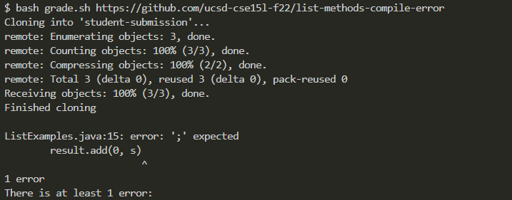
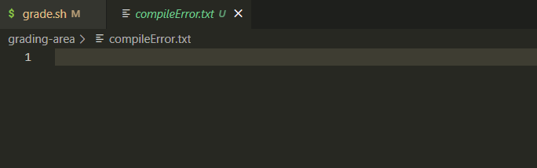
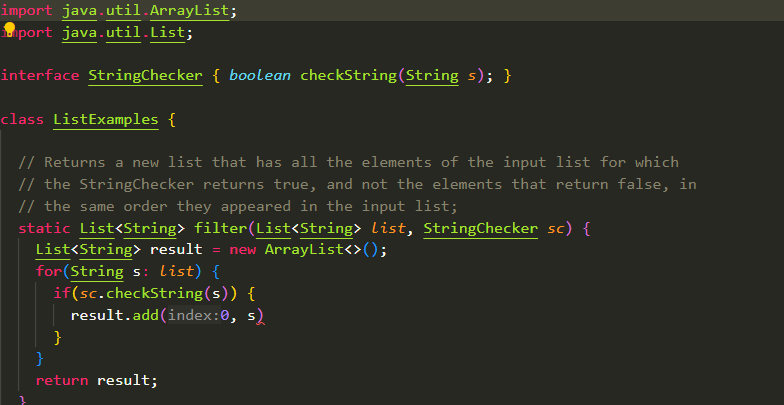
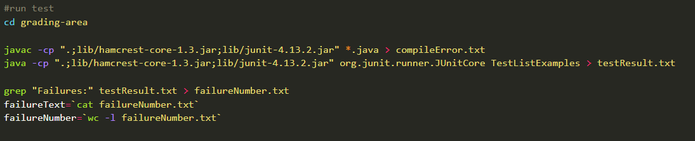
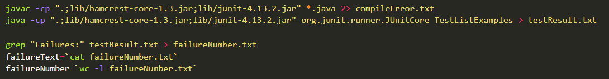
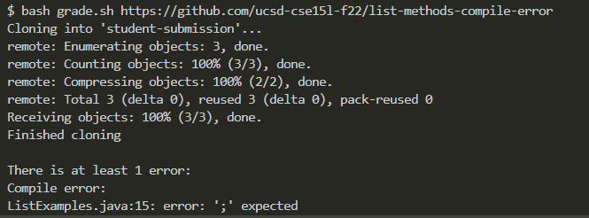
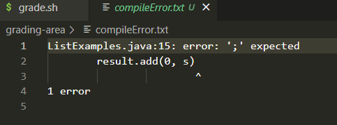
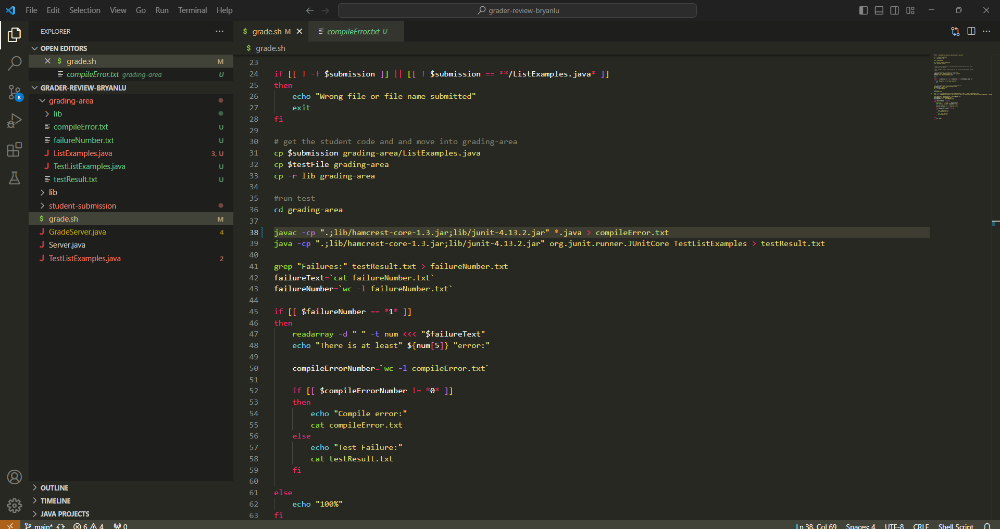

# Lab Report 5
---
## Part 1
1. Student: Hi, I am having trouble with my grader bash script right now. I am trying to detect the error where the java program I am testing has a compile error, but there is nothing that is showing up in
   the .txt file where I am redirecting the output to. I don't really know why it is not and I'm guessing it has something to redirecting output from the compile method but I don't know.

   
   
   
   

2. TA: Hi, so I see that you are having trouble there, so it looks like you are trying to find and redirect output for an *error*. So are there any different things we can do for working with *errors*?

3. Student: Oh yeh I remember that there were two types of output, stdout and stderr, and depending on which one we want to redirect, we want to use a certain redirection command. In the case of stderr which is what I want,
   I would want to use `2>` instead of `>` when I redirect the error output from the compiling command. Now in the terminal output, it isn't outputting the error and in the .txt file I can see the compile error.

   
   
   

4. I used the grading script from Week 6 that I worked on and tweaked the compile error output redirecter so that it would not work properly. From above, I ran `bash grade.sh https://github.com/ucsd-cse15l-f22/list-methods-compile-error`
   to trigger the error. It basically runs the script using the method with the compile error in it.

   

---
## Part 2

I really liked learning about the java debugger. I just think that it is a really cool and useful tool to have. The idea of being able to stop the program at any point while it runs and getting access to loads of information is a
great resource to have, and if I learn to use if effectively it will help me a lot in the future.

[HOME](https://guiuiy.github.io/cse15l-lab-reports/)

